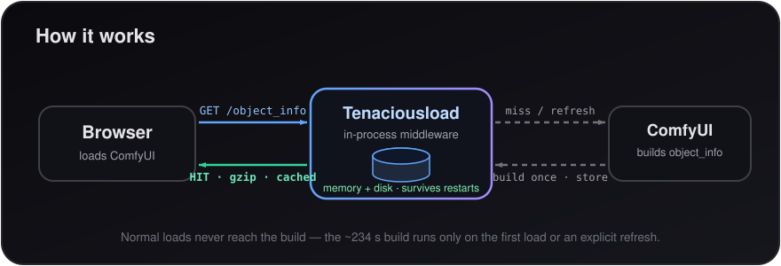

<p align="center">
  
</p>

# ComfyUI-Tenaciousload

Self-contained fix for slow / black-screen ComfyUI loading when you have a huge
model/LoRA collection (especially on a network mount). **Just install the pack
and restart ComfyUI — no nginx, no docker, no extra port.**

## The problem
ComfyUI's `/api/object_info` enumerates every node's inputs. With thousands of
LoRAs (worse on a network mount) it becomes tens of MB and takes **minutes to
build on every page load** — and the build **freezes ComfyUI's whole event
loop**, so you get a long black screen, worst over a remote network.

## How this pack fixes it

<p align="center">
  
</p>

On load it injects an aiohttp **middleware** into ComfyUI that intercepts
`/object_info` and `/api/object_info` and:

- **caches the built response in memory _and_ on disk** (`./cache/`), so it is
  built once instead of on every load — and the disk copy makes **restarts
  instant** (no rebuild);
- **serves it gzipped** (≈85% smaller transfer, independent of any CLI flag),
  straight from cache **without running the build**;
- because the build never runs on a normal load, the event-loop freeze (and the
  long black screen) is gone — page loads drop from **minutes to seconds**.

The only time a build runs is the first load after install, or when you
explicitly refresh (below).

## Refreshing after you add / remove models or LoRAs
The cache holds the old model lists until you refresh. Three modes are available
from the **`Extensions`** menu (and the command palette):

| Mode | What it does | Speed |
|------|--------------|-------|
| ⚡ **Quick refresh** | Re-walks only the folders whose timestamp **changed** since the last scan; reuses the cache for the rest. Catches new / removed / renamed files. | Fast on local disks; **~2× faster** on a slow network mount (it still has to stat every folder to find which changed). |
| 🔄 **Full refresh** | Clears ComfyUI's folder cache and re-walks **everything**. Catches moves/deletes anywhere. | Slowest (the original behaviour). |
| ➕ **Register new file…** | You give it the path(s) of the file(s) you just added; it appends them to the cache with **no folder walk**. | Instant disk-wise — only the `object_info` rebuild remains. |

Also available:
- **Graph node** `🔄 Refresh Models/LoRAs (Tenaciousload)` with a `mode` widget
  (`quick` / `full`), for automated workflows.
- **HTTP:** `POST /tenaciousload/refresh` with
  `{"mode": "quick" | "full" | "register", "folder": "loras", "files": ["pack/new.safetensors"]}`,
  then `GET /object_info?nocache=1`.

> The **first** Quick refresh after install builds a folder index (one full walk),
> so it's as slow as a Full refresh that one time; every Quick refresh after that
> is incremental. The index is saved to `./cache/scan_snapshot.json`.

Whichever mode you pick, the button shows a "refreshing…" toast and normal loads
stay instant.

## Requirements
**None to install.** Only ComfyUI itself (tested on 0.23.0) and Python ≥ 3.8.
Everything used is Python stdlib or already bundled with ComfyUI (`aiohttp`,
`folder_paths`, `server`). The web button needs no npm packages.

## Install
Clone (or copy) this repo into your ComfyUI `custom_nodes/` folder and restart
ComfyUI:

```bash
cd ComfyUI/custom_nodes
git clone https://github.com/ethanfel/ComfyUI-Tenaciousload.git
# then restart ComfyUI
```
Nothing to `pip install`. ComfyUI-Manager can also install it from the registry.

## Verify it's working
After restart, load the page once (first time builds + caches), then:
```bash
curl -s -H 'Accept-Encoding: gzip' -o /dev/null \
  -w '%{time_total}s | %{size_download} bytes | %header{x-tenaciousload-cache} | %header{content-encoding}\n' \
  http://127.0.0.1:8188/api/object_info   # use your ComfyUI port
# expect after the first load: ~0.00Xs | ~10 MB | HIT | gzip
```
ComfyUI's startup log should show `Tenaciousload: object_info cache middleware installed`.

## Recommended: gzip the rest of ComfyUI
This pack already gzips the cached `object_info` on its own. To **also** gzip
everything else ComfyUI serves — most importantly the *hundreds* of frontend
extension scripts, plus the other API responses — launch ComfyUI with its
built-in compression flag:

```bash
python main.py --listen --port 8188 --enable-compress-response-body
```

- It's a **stock ComfyUI** option (defined in `comfy/cli_args.py`), not part of
  this pack, and it's **optional** — Tenaciousload works fine without it.
- It's strongly recommended for **remote access**: those extension scripts are
  many small requests that compress very well, so the flag noticeably cuts the
  total transfer on top of the `object_info` cache.
- It costs a little CPU per response to compress; on a fast machine this is
  negligible compared to the bytes saved over the network.

## Notes
- **Loading status:** instead of ComfyUI's silent "Comfy" splash, a small status
  line shows whether it's *serving from cache* or *building* (with node count +
  elapsed time), so a long rebuild isn't a black screen with no feedback. It
  removes itself once the app is ready. Status is also at `GET /tenaciousload/status`.
- The disk cache lives in `./cache/` (git-ignored). Delete it, or use the refresh
  button, to force a rebuild.
- An nginx reverse proxy can cache `object_info` at the HTTP layer too, but this
  pack does it in-process so no extra service, container, or port is needed.
- **New files in the `input` folder** are picked up by a **refresh button** by
  default (same as new models) — they do *not* trigger an automatic rebuild on
  restart. To auto-detect them on restart instead, set
  `TENACIOUSLOAD_WATCH_INPUT=1`. Only do this if your input folder is fairly
  static: on a busy input folder (e.g. a video workflow that adds clips
  constantly) the input dir changes on nearly every restart, which would
  invalidate the cache and force a slow rebuild each time — defeating the point.

## Installing / updating other custom nodes
This pack is a quiet neighbour:
- **No dependencies** — its `requirements.txt` is empty, so it can't cause the
  pip version conflicts that break other nodes' installs/updates. It also never
  touches other nodes' files or the ComfyUI-Manager installer.
- **Auto-detects node changes** — it fingerprints the installed node set
  (`NODE_CLASS_MAPPINGS`) and, on the first page load after a restart, drops the
  cache automatically if a node was **installed, updated, enabled or removed** —
  so new nodes appear with no manual refresh.
- The only thing it gates is the full `/object_info` list (a cached snapshot);
  it passes every other request straight through, so other nodes' own routes,
  sidebars and refresh buttons are unaffected. For an in-place node tweak that
  changes an existing node's inputs *without* adding/removing a node class, use a
  refresh button.

## License
MIT — see [LICENSE](LICENSE).
